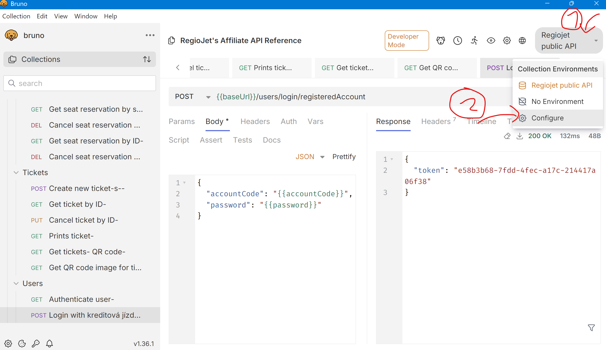

# Regiojet API

The API is not public, but since their website uses it, it is possible to reverse-engineer it.

- See [official documentation](https://regiojet.com/about-us/affiliate/api).
- See [swagger documentation](https://app.swaggerhub.com/apis/regiojet/affiliate/1.1.0).
- See [downloaded swagger](./regiojet-affiliate-1.1.0-resolved.json).

We use [Bruno](https://www.usebruno.com/) for storing the API definiton. The folder `./bruno`
is synchronized with the Bruno project and is versioned in git.

All of the example requests are already configured in the Bruno project.

## Using Bruno

1. Inside Bruno, open a collection (the folder `./bruno`).
2. Choose an environment (upper right-hand corner) as `Regiojet public API`.
3. Fill in secret values like this:




## Description of endpoints

- Look at the Booking API section of [the docs](https://regiojet.com/about-us/affiliate/api).

## Authentication

The downloaded swagger is missing the authentication process. Therefore, we added it manually
as the `Login with kreditová jízdenka` request.

- `POST /users/login/registeredAccount`
```json
{"accountCode":"NUMBER","password":"PASSWORD"}
```

After logging in successfully, we are granted a UUID. 
This should be used as a `Authorization: Bearer <uuid_token>` header in subsequent requests.

## Generated API client

How we have generated the code inside the `openapi` folder:

1. `npm install @openapitools/openapi-generator-cli -g`
2. `openapi-generator-cli generate -i ./regiojet-affiliate-1.1.0-resolved.json -g go -o openapi --skip-validate-spec`

Look inside [the readme](./openapi/README.md) to see how to use the generated client.

### Changes made to the generated code

- Comment out code which reference non-existing `*Object` type
- Remove `go.mod` and `go.sum` files from the `openapi` folder, so that we do not
  have multiple modules in the project.
- Find `github.com/GIT_USER_ID/GIT_REPO_ID` and replace with `github.com/metju-ac/train-me-maybe/openapi`
- Inside `openapi\configuration.go`, comment out the `https://brn-qa-ybus-privapi.sa.cz/affiliate` and replace with public `https://brn-ybus-pubapi.sa.cz/restapi` URL
- There were other changes to the models which were wrongly generated -- see the commit history.

### Temporary notes - for automatic purchasing

- vyhledat brno->praha uz se zalogovanym:
```
https://brn-ybus-pubapi.sa.cz/restapi/routes/search/simple?tariffs=CZECH_STUDENT_PASS_26&toLocationType=CITY&toLocationId=10202003&fromLocationType=CITY&fromLocationId=10202002&departureDate=2025-01-24&fromLocationName=&toLocationName=
```

- kliknutí na spoj udělá tento request a přesměruje na výběr třídy (low cost atd)
```
https://brn-ybus-pubapi.sa.cz/restapi/routes/7558539230/simple?fromStationId=3088864001&routeId=7558539230&toStationId=372825000&tariffs=CZECH_STUDENT_PASS_26
```

- kliknu na LOW COST - udela se dotaz
```
https://brn-ybus-pubapi.sa.cz/restapi/routes/freeSeats

{"sections":[{"sectionId":7558539230,"fromStationId":3088864001,"toStationId":372825000}],"seatClass":"TRAIN_LOW_COST","tariffs":["CZECH_STUDENT_PASS_26"]}
```
  - v selectedSeats je vzdy prvni sedadlo, ktere je volne - lze vyuzit!

- kliknu na pokračovat - nic zajímavého se nestane (dotaz na `https://brn-ybus-pubapi.sa.cz/restapi/addons` coz jsou taxiky, aquapalace atd)

- kliknu znova na pokračovat - dotaz
```
https://brn-ybus-pubapi.sa.cz/restapi/routes/7558539230/passengersData

{"priceSource":"7583030916<3088864001-372825000-7583030916>","seatClass":"TRAIN_LOW_COST","sections":[{"sectionId":7558539230,"fromStationId":3088864001,"toStationId":372825000}],"tariffs":["CZECH_STUDENT_PASS_26"]}
```

- kliknu na Rovnou zaplatit kreditem
```
https://brn-ybus-pubapi.sa.cz/restapi/tickets/create/registered

{"ticketRequests":[{"passengers":[{"tariff":"CZECH_STUDENT_PASS_26","phone":"+420705216492","email":"robert.gemrot@centrum.cz"}],"route":{"routeId":"7558539230","priceSource":"7583030916<3088864001-372825000-7583030916>","sections":[{"section":{"fromStationId":3088864001,"sectionId":7558539230,"toStationId":372825000},"selectedSeats":[{"sectionId":7558539230,"vehicleNumber":2,"seatIndex":1}]}],"seatClass":"TRAIN_LOW_COST"},"selectedAddons":[],"percentualDiscountIds":[]}]}
```

coz vrati nezaplaceny listek. A rovnou vzapeti se automaticky zavola
```
https://brn-ybus-pubapi.sa.cz/restapi/payments/credit/charge

{"tickets":[{"type":"RJ_SEAT","id":7597162959}]}
```

coz listek zaplati.