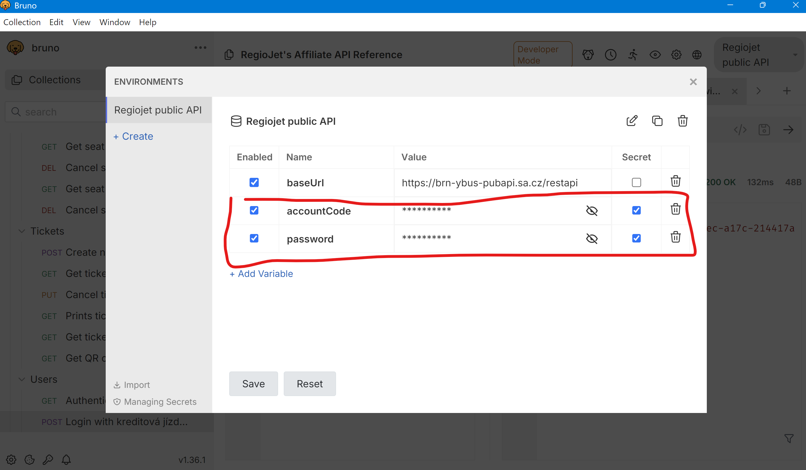

# Regiojet API

The API is not public, but since their website uses it, it is possible to reverse-engineer it.

- See [official documentation](https://regiojet.com/about-us/affiliate/api).
- See [swagger documentation](https://app.swaggerhub.com/apis/regiojet/affiliate/1.1.0).
- See [downloaded swagger](./regiojet-affiliate-1.1.0-resolved.json).

We use [Bruno](https://www.usebruno.com/) for storing the API definiton. The folder `./bruno`
is synchronized with the Bruno project and is versioned in git.

All of the example requests are already configured in the Bruno project.

## Using Bruno

1. Inside Bruno, open a collection (the folder `./bruno`).
2. Choose an environment (upper right-hand corner) as `Regiojet public API`.
3. Fill in secret values like this:





## Description of endpoints

- Look at the Booking API section of [the docs](https://regiojet.com/about-us/affiliate/api).

## Authentication

The downloaded swagger is missing the authentication process. Therefore, we added it manually
as the `Login with kreditová jízdenka` request.

- `POST /users/login/registeredAccount`
```json
{"accountCode":"NUMBER","password":"PASSWORD"}
```

After logging in successfully, we are granted a UUID. 
This should be used as a `Authorization: Bearer <uuid_token>` header in subsequent requests.

## Generated API client

How we have generated the code inside the `openapi` folder:

1. `npm install @openapitools/openapi-generator-cli -g`
2. `openapi-generator-cli generate -i ./regiojet-affiliate-1.1.0-resolved.json -g go -o openapi --skip-validate-spec`

Look inside [the readme](./openapi/README.md) to see how to use the generated client.

### Changes made to the generated code

- Comment out code which reference non-existing `*Object` type
- Remove `go.mod` and `go.sum` files from the `openapi` folder, so that we do not
  have multiple modules in the project.
- Find `github.com/GIT_USER_ID/GIT_REPO_ID` and replace with `github.com/metju-ac/train-me-maybe/openapi`
- Inside `openapi\configuration.go`, comment out the `https://brn-qa-ybus-privapi.sa.cz/affiliate` and replace with public `https://brn-ybus-pubapi.sa.cz/restapi` URL
- There were other changes to the models which were wrongly generated -- see the commit history.

### Temporary notes - for automatic purchasing

- vyhledat brno->praha uz se zalogovanym:
```
https://brn-ybus-pubapi.sa.cz/restapi/routes/search/simple?tariffs=CZECH_STUDENT_PASS_26&toLocationType=CITY&toLocationId=10202003&fromLocationType=CITY&fromLocationId=10202002&departureDate=2025-01-24&fromLocationName=&toLocationName=
```

- kliknutí na spoj udělá tento request a přesměruje na výběr třídy (low cost atd)
```
https://brn-ybus-pubapi.sa.cz/restapi/routes/7558539230/simple?fromStationId=3088864001&routeId=7558539230&toStationId=372825000&tariffs=CZECH_STUDENT_PASS_26
```

- kliknu na LOW COST - udela se dotaz
```
https://brn-ybus-pubapi.sa.cz/restapi/routes/freeSeats

{"sections":[{"sectionId":7558539230,"fromStationId":3088864001,"toStationId":372825000}],"seatClass":"TRAIN_LOW_COST","tariffs":["CZECH_STUDENT_PASS_26"]}
```
  - v selectedSeats je vzdy prvni sedadlo, ktere je volne - lze vyuzit!

- kliknu na pokračovat - nic zajímavého se nestane (dotaz na `https://brn-ybus-pubapi.sa.cz/restapi/addons` coz jsou taxiky, aquapalace atd)

- kliknu znova na pokračovat - dotaz
```
https://brn-ybus-pubapi.sa.cz/restapi/routes/7558539230/passengersData

{"priceSource":"7583030916<3088864001-372825000-7583030916>","seatClass":"TRAIN_LOW_COST","sections":[{"sectionId":7558539230,"fromStationId":3088864001,"toStationId":372825000}],"tariffs":["CZECH_STUDENT_PASS_26"]}

toto volani se klidne muze preskocit to vypada
```

- nacist si kontaktni data 
```
GET https://brn-ybus-pubapi.sa.cz/restapi/users/authenticate
Header: Authorization Bearer <token>
reponse
{"id":3737878598,"accountCode":"0347812899","firstName":"Robert","surname":"Gemrot","phoneNumber":"+420705216492","restrictPhoneNumbers":false,"email":"robert.gemrot@centrum.cz","credit":726.00,"creditPrice":true,"currency":"CZK","defaultTariffKey":"CZECH_STUDENT_PASS_26","notifications":{"newsletter":false,"reservationChange":true,"routeRatingSurvey":false},"companyInformation":false,"company":null,"conditionsAcceptance":true,"employeeNumber":null,"totalCarbonOffset":0,"savedCard":null}
```


- kliknu na Rovnou zaplatit kreditem
```
https://brn-ybus-pubapi.sa.cz/restapi/tickets/create/registered

{"ticketRequests":[{"passengers":[{"tariff":"CZECH_STUDENT_PASS_26","phone":"+420705216492","email":"robert.gemrot@centrum.cz"}],"route":{"routeId":"7558539384","priceSource":"7583030916<3088864001-372825000-7583030916>","sections":[{"section":{"fromStationId":3088864001,"sectionId":7558539384,"toStationId":372825000},"selectedSeats":[{"sectionId":7558539384,"vehicleNumber":2,"seatIndex":12}]}],"seatClass":"TRAIN_LOW_COST"},"selectedAddons":[],"percentualDiscountIds":[]}]}

response:
{"tickets":[{"ticketCode":"2996929539","actionName":null,"wheelChairPlatformOrderPossible":false,"wheelChairPlatformOrdered":false,"carbonOffset":null,"id":7597954842,"routeId":"7558539384","price":137,"unpaid":137,"currency":"CZK","state":"UNPAID","seatClassKey":"TRAIN_LOW_COST","conditions":{"descriptions":{"cancel":"více než 15 minut do odjezdu: 0 %, méně než 15 minut: nelze stornovat","cancelShort":"> 15 minut: 0 %, < 15 minut: nelze","rebook":"více než 15 minut do odjezdu: stornem za 0 CZK, méně než 15 minut: nelze přerezervovat","rebookShort":null,"expiration":"27 minut (29.12.24 15:44 SEČ)"},"code":"34650e8d379a0563158e9c45b9fc2957","refundToOriginalSourcePossible":true,"cancelCharge":0,"cancelCharges":[]},"expirationDate":"2024-12-29T15:44:38.119+01:00","expirateAt":{"days":0,"hours":0,"minutes":27},"customerNotifications":[],"customerActions":{"showDetail":true,"pay":true,"payRemaining":false,"evaluate":false,"cancel":true,"storno":false,"rebook":true,"editPassengers":true,"additionalServices":true,"sentToMail":true,"printTicket":true,"printInvoice":false,"requiredToFillInQuestionnaire":false},"routeSections":[{"section":{"id":7558539384,"vehicleStandardKey":"YELLOW","support":false,"supportCode":"","vehicleType":"TRAIN","fixedSeatReservation":true,"line":{"lineGroupCode":"VLAK_BRNO","lineNumber":260,"id":7455241074,"code":"RJ 1030","from":"Vídeň","to":"Praha"},"departureStationId":3088864001,"departureStationName":"hl.n.","departureCityId":10202002,"departureCityName":"Brno","departureTime":"2025-01-31T08:09:00.000+01:00","departurePlatform":null,"arrivalStationId":372825000,"arrivalStationName":"hl.n.","arrivalCityId":10202003,"arrivalCityName":"Praha","arrivalTime":"2025-01-31T10:39:00.000+01:00","arrivalPlatform":null,"carrierId":5044895002,"freeSeatsCount":null,"notices":[],"services":["typy_vozidel_klimatizace","typy_vozidel_stevardka","typy_vozidel_teple_napoje_zdarma","typy_vozidel_wifi_ano","typy_vozidel_obcerstveni","typy_vozidel_denni_tisk","typy_vozidel_zabavni_portal_ano","typy_vozidel_sluchatka","typy_vozidel_zasuvka","typy_vozidel_tiche_kupe","typy_vozidel_detske_kupe","typy_vozidel_imobilni_rampa"],"delay":null,"travelTime":"02:30 h","estimatedArrivalTime":"2025-01-31T10:39:00.000+01:00"},"fixedSeatReservation":true,"selectedSeats":[{"sectionId":7558539384,"vehicleNumber":2,"seatIndex":12}],"vehicles":[{"cateringEnabled":true,"vehicleId":7558795833,"code":null,"layoutURL":"vehicle_layout/vlak_vuz-bm-astra-80.svg","horizontalLayoutURL":"vehicle_layout/2020_vlak_horizontalni_vuz-bm-astra-80.svg","type":"TRAIN","vehicleStandardKey":"YELLOW","vehicleNumber":1,"vehicleSeatClasses":[{"name":"C0","services":[]}],"notifications":[],"freeSeats":[],"occupiedSeats":[]},{"cateringEnabled":true,"vehicleId":7558795838,"code":null,"layoutURL":"vehicle_layout/vlak_vuz-Bp2_ver.svg","horizontalLayoutURL":"vehicle_layout/vlak_vuz-Bp2_hor.svg","type":"TRAIN","vehicleStandardKey":"YELLOW","vehicleNumber":2,"vehicleSeatClasses":[{"name":"TRAIN_LOW_COST","services":[]}],"notifications":[],"freeSeats":[],"occupiedSeats":[]},{"cateringEnabled":true,"vehicleId":7558795837,"code":null,"layoutURL":"vehicle_layout/vlak_vuz-bm-astra-80.svg","horizontalLayoutURL":"vehicle_layout/2020_vlak_horizontalni_vuz-bm-astra-80.svg","type":"TRAIN","vehicleStandardKey":"YELLOW","vehicleNumber":3,"vehicleSeatClasses":[{"name":"C0","services":[]}],"notifications":[],"freeSeats":[],"occupiedSeats":[]},{"cateringEnabled":false,"vehicleId":7558795836,"code":null,"layoutURL":"vehicle_layout/vlak_vuz-ab-42.svg","horizontalLayoutURL":"vehicle_layout/2020_vlak_horizontalni_vuz-ab-42.svg","type":"TRAIN","vehicleStandardKey":"YELLOW","vehicleNumber":4,"vehicleSeatClasses":[{"name":"C0","services":[]}],"notifications":[],"freeSeats":[],"occupiedSeats":[]},{"cateringEnabled":false,"vehicleId":7558795835,"code":null,"layoutURL":"vehicle_layout/vlak_vuz-a-48.svg","horizontalLayoutURL":"vehicle_layout/2020_vlak_horizontalni_vuz-a-48.svg","type":"TRAIN","vehicleStandardKey":"YELLOW","vehicleNumber":5,"vehicleSeatClasses":[{"name":"C2","services":[]},{"name":"C1","services":[]}],"notifications":[],"freeSeats":[],"occupiedSeats":[]},{"cateringEnabled":false,"vehicleId":7558795834,"code":null,"layoutURL":"vehicle_layout/vlak_vuz-a-48.svg","horizontalLayoutURL":"vehicle_layout/2020_vlak_horizontalni_vuz-a-48.svg","type":"TRAIN","vehicleStandardKey":"YELLOW","vehicleNumber":6,"vehicleSeatClasses":[{"name":"C2","services":[]},{"name":"C1","services":[]}],"notifications":[],"freeSeats":[],"occupiedSeats":[]},{"cateringEnabled":true,"vehicleId":7558795839,"code":null,"layoutURL":"vehicle_layout/Bm1xx48_ver_seda.svg","horizontalLayoutURL":"vehicle_layout/Bm1xx48_hor_seda.svg","type":"TRAIN","vehicleStandardKey":"YELLOW","vehicleNumber":7,"vehicleSeatClasses":[{"name":"TRAIN_LOW_COST","services":[]}],"notifications":[],"freeSeats":[],"occupiedSeats":[]}]}],"addons":[],"paymentId":null,"bills":[{"number":7598022612,"type":"BOOK","vatRate":12.00,"amountWithoutVat":122.33,"vatAmount":14.67,"dateOfChargeableEvent":null,"amount":137,"currency":"CZK","label":"Za jízdenku"}],"usedCodeDiscount":null,"usedPercentualDiscounts":[],"transfersInfo":null,"surcharge":0,"cancelChargeSum":0,"cancelMoneyBackSum":0,"passengersInfo":{"passengers":[{"id":7598014456,"firstName":null,"surname":null,"phone":"+420705216492","email":"robert.gemrot@centrum.cz","dateOfBirth":null,"tariff":"CZECH_STUDENT_PASS_26","amount":139,"moneyBack":null}],"firstPassengerData":[],"otherPassengersData":[],"changeCharge":0},"delay":null,"travelTime":"02:30 h","estimatedArrivalTime":"2025-01-31T10:39:00.000+01:00","affiliateTicket":false}]}
```

coz vrati nezaplaceny listek. A rovnou vzapeti se automaticky zavola
```
https://brn-ybus-pubapi.sa.cz/restapi/payments/credit/charge

{"tickets":[{"type":"RJ_SEAT","id":7597162959}]}

response:
{"amount":589.00,"currency":"CZK"}
```

coz listek zaplati.